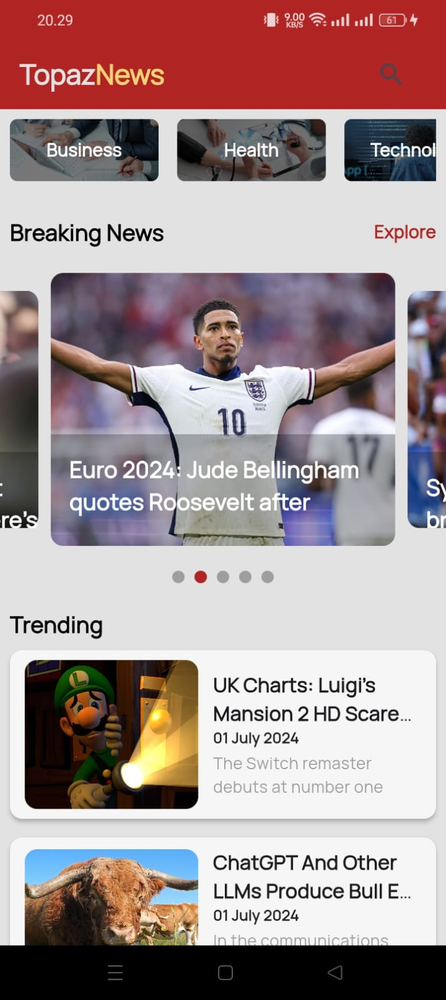

# Aplikasi Berita dengan Integrasi NewsAPI berbasis Mobile "TopazNews"

Perancangan aplikasi berita berbasis mobile menggunakan News API untuk menyajikan berita real-time. Tujuannya adalah menciptakan platform yang dapat memenuhi kebutuhan pengguna akan akses berita cepat dan akurat. 

## Fitur Aplikasi
- Melihat berita terbaru (Breaking News)
- Melihat berita terpopuler (Trending)
- Melihat berita sesuai kategori
- Mencari berita berdasarkan kata kunci

## NewsAPI
https://newsapi.org/

## Kebutuhan Dependencies
- SDK: >=3.3.1 <4.0.0
- cupertino_icons: ^1.0.6
- provider: ^6.1.2
- dio: ^5.4.3+1
- fancy_shimmer_image: ^2.0.3
- carousel_slider: ^4.2.1
- smooth_page_indicator: ^1.1.0
- webview_flutter: ^3.0.1
- intl: ^0.19.0

## Tampilan Aplikasi

  
  

